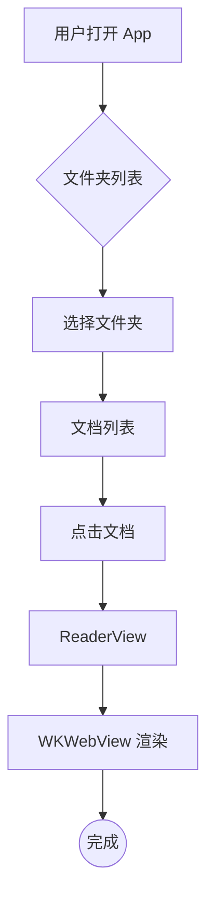

# Markdown 渲染测试

## 基础排版

**粗体**、*斜体*、~~删除线~~、`行内代码`

> 引用块：知之为知之，不知为不知，是知也。

---

## GFM 任务列表

- [x] marked.js 集成
- [x] KaTeX 数学公式
- [x] Mermaid 流程图
- [ ] 批注功能

## 表格

| 功能 | 状态 | 备注 |
|------|------|------|
| Markdown 渲染 | ✅ | 基于 marked.js |
| 数学公式 | ✅ | KaTeX |
| 流程图 | ✅ | Mermaid |
| 代码高亮 | ✅ | highlight.js |

---

## 代码块

```swift
@MainActor
@Observable
final class FolderStore {
    private(set) var rootFolders: [Folder] = []

    func load(context: ModelContext) {
        let descriptor = FetchDescriptor<Folder>(
            predicate: #Predicate { $0.parent == nil }
        )
        rootFolders = (try? context.fetch(descriptor)) ?? []
    }
}
```

```python
def fibonacci(n: int) -> list[int]:
    a, b = 0, 1
    result = []
    for _ in range(n):
        result.append(a)
        a, b = b, a + b
    return result
```

---

## 数学公式

行内公式：质能方程 $E = mc^2$，欧拉恒等式 $e^{i\pi} + 1 = 0$

块级公式：

$$
\int_{-\infty}^{\infty} e^{-x^2} dx = \sqrt{\pi}
$$

$$
\frac{\partial^2 u}{\partial t^2} = c^2 \nabla^2 u
$$

---

## Mermaid 流程图



---

## 图片与链接

[Apple Developer](https://developer.apple.com)

---

*渲染测试文件 — MarkdownReader MVP*
